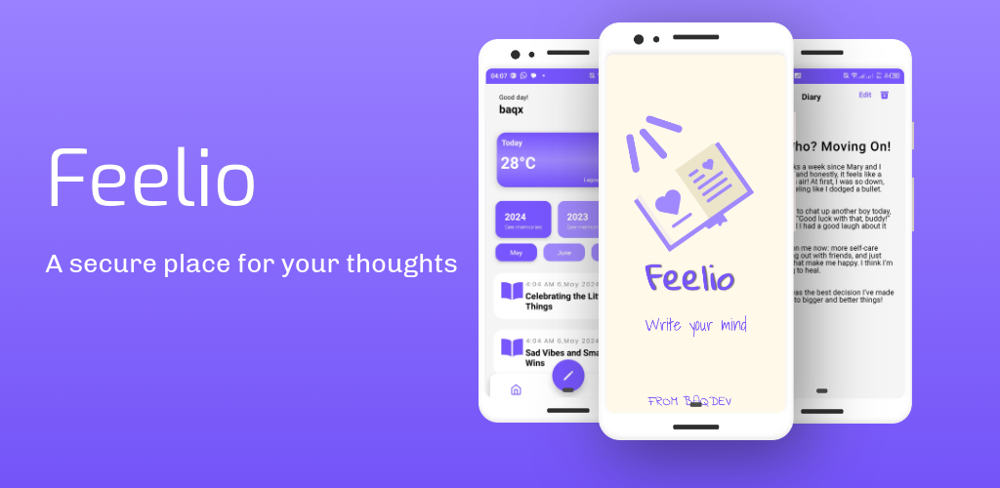

<h1 align="center">Feelio</h1>

  

  

## Introduction

Feelio - Your Private Space

Write your thoughts, feelings, and stories in a safe and beautiful digital diary. Express yourself freely, reflect on your journey, and grow with Feelio.
Start writing your story today!

## Requirements

- NPM (Node Package Manager)
- React-Native
- Expo

## Features

- Lock your diary with a password
- Customize your interface with colors
- Organize your thoughts
- Access your diary anywhere, anytime

## Setup

Install all packages

> npm install

Get your weatherapi.com api key, create .env and put it in

> API_KEY= "YOUR_KEY"; // Replace with your API key

Run expo

> npx expo start --tunnel

Build via eas:
eas build --platform android --profile preview
